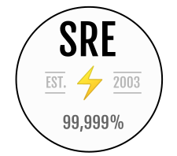

# Awesome Site Reliability Engineering  

A curated list of awesome [Site Reliability](https://www.usenix.org/conference/srecon14/technical-sessions/presentation/keys-sre) and [Production](https://www.usenix.org/conference/srecon15/program/presentation/canahuati) Engineering resources.

#### What is Site Reliability Engineering?
> "Fundamentally, it's what happens when you ask a software engineer to design an operations function." - Ben Treynor Sloss, VP Google Engineering, founder of Google SRE

## Contributing

Please take a look at the [contribution guidelines](CONTRIBUTING.md) first.
Contributions are always welcome!

## Contents
  - [Culture](#culture)
  - [Education](#education)
  - [Books](#books)
  - [Hiring](#hiring)
  - [Reliability](#reliability)
  - [Monitoring & Observability & Alerting](#monitoring--observability--alerting)
  - [On-Call](#on-call)
  - [Post-Mortem](#post-mortem)
  - [Capacity Planning](#capacity-planning)
  - [Service Level Agreement](#service-level-agreement)
  - [Performance](#performance)
  - [Programming](#programming)
  - [Misc Articles](#misc-articles)
  - [Real-time Messaging](#real-time-messaging)
  - [Blogs](#blogs)
  - [Newsletters](#newsletters)
  - [Conferences & Meetups](#conferences--meetups)
  - [Twitter](#twitter)
  - [SRE Tools](#sre-tools)

## Culture
* [What is Site Reliability Engineering?](https://landing.google.com/sre/interview/ben-treynor.html)
* [Keys To SRE by Ben Treynor](https://www.usenix.org/conference/srecon14/technical-sessions/presentation/keys-sre)
* [Google SRE Resources](https://landing.google.com/sre/resources.html)
* [Notes from Production Engineering by Pedro Canahuati](https://www.usenix.org/conference/srecon15/program/presentation/canahuati)
* [PostOps: Recovery from Operations](https://www.usenix.org/conference/srecon15europe/program/presentation/underwood)
* [Love DevOps? Wait 'till you meet SRE](https://www.atlassian.com/it-service/site-reliability-engineering-sre) [[video]](https://youtu.be/fsTpRx8Pt-k)
* [How Google Does Planet-Scale Engineering for Planet-Scale Infra](https://www.youtube.com/watch?v=H4vMcD7zKM0)
* [Site Reliability Engineering at Facebook](https://www.facebook.com/notes/facebook-engineering/site-reliability-engineering-at-facebook/291616313919/)
* [A History of Site Reliability Engineering at Uber](https://www.youtube.com/watch?v=qJnS-EfIIIE&nohtml5=False)
* [Case Study: Adopting SRE Principles at StackOverflow](https://www.usenix.org/conference/srecon15/program/presentation/limoncelli)
* [Site Reliability Engineering at Dropbox](https://www.youtube.com/watch?v=ggizCjUCCqE)
* [Site Reliability Engineers — Keeping Google up and running 24/7](https://www.youtube.com/watch?v=yXI7r0_J29M)
* [Site Reliability Engineering at Salesforce](https://www.youtube.com/watch?v=JLkr6UHXN44&nohtml5=False)
* From Sys Admin to Netflix SRE - [video](https://www.youtube.com/watch?v=lZI51YzIgVE) and [slides](https://www.socallinuxexpo.org/sites/default/files/presentations/Scale%20x14%20Slides.pdf)
* [SRE@Google: Thousands of DevOps Since 2004](https://www.youtube.com/watch?v=iIuTnhdTzK0)
* [Transactional System Administration Is Killing Us and Must be Stopped](https://www.usenix.org/conference/lisa15/conference-program/presentation/limoncelli)
* [A hierarchy of SRE needs](https://web.archive.org/web/20190401220948/https://plus.google.com/+lizthegrey/posts/MLAJFVyEb2f)
* [PostOps: A Non-Surgical Tale of Software, Fragility, and Reliability](https://www.usenix.org/conference/lisa13/technical-sessions/plenary/underwood)
* [SRE: An incomplete guide to cultural Narnia](https://web.archive.org/web/20180820235243/http://anthonycaiafa.com/2016/04/10/sre-cultural-narnia/) - [[Video]](https://www.youtube.com/watch?v=__wypEhdcrQ&t=0s)
* [Putting Together Great SRE Teams](https://www.usenix.org/conference/srecon16/program/presentation/krishnan)
* [Work at Google: Meet our Production Engineers for Site Reliability Hangout on Air](https://www.youtube.com/watch?v=bwt6TZjefGM)
* [Toil: A Word Every Engineer Should Know](https://sharpend.io/toil-a-word-every-engineer-should-know/)
* [Engineering Reliability into Web Sites: Google SRE](https://research.google.com/pubs/pub32583.html)
* [DEVOPS & SRE AMA - Building High Performance Organizations](http://pages.catchpoint.com/DEVOPS-SRE-AMA-mkty.html)
* [John Allspaw's AMA on Incident Analysis and Postmortems](https://community.atlassian.com/t5/Jira-Ops-questions/I-m-John-Allspaw-Ask-Me-Anything-about-incident-analysis-and/qaq-p/957084)
* Site Reliability Engineering with Paul Newson - [Part 1](https://www.gcppodcast.com/post/episode-38-site-reliability-engineering-with-paul-newson/) & [Part 2](https://gcppodcast.com/post/episode-59-sre-ii-with-paul-newson/)
* [How SysAdmins Devalue Themselves](https://queue.acm.org/detail.cfm?id=2891413)
* [The Softer Side of DevOps](https://www.youtube.com/watch?v=ry51Llzil1I)
* [SRE, noun. See also: confidence, trust.](https://medium.com/@kobolog/sre-noun-see-also-confidence-trust-e7e33e19efc1)
* [Site Reliability Engineering with Stephen Weinberg](https://youtu.be/24xb7oZgu-I?t=29m24s)
* [We are the Google Site Reliability team. We make Google’s websites work. Ask us Anything!](https://www.reddit.com/r/IAmA/comments/177267/we_are_the_google_site_reliability_team_we_make)
* [We are the Google Site Reliability Engineering team. Ask us Anything!](https://www.reddit.com/r/IAmA/comments/1w1y5m/we_are_the_google_site_reliability_engineering/)
* [The Ops Identity Crisis](http://www.susanjfowler.com/blog/2016/10/13/the-ops-identity-crisis)
* [The Irreproducibility Of Bugs In Large-Scale Production Systems](http://www.susanjfowler.com/blog/2016/11/2/the-irreproducibility-of-bugs-in-large-scale-production-systems)
* [SE-Radio Episode 276: Björn Rabenstein on Site Reliability Engineering](http://www.se-radio.net/2016/12/se-radio-episode-276-bjorn-rabenstein-on-site-reliability-engineering/)
* [Microservices, DevOps and Production Complexity](https://blog.netsil.com/microservices-devops-and-operational-complexity-be98cb01b660)
* [Introducing Google Customer Reliability Engineering](https://cloudplatform.googleblog.com/2016/10/introducing-a-new-era-of-customer-support-Google-Customer-Reliability-Engineering.html)
* [Evolution or Rebellion? The rise of Site Reliability Engineers (SRE)](https://robhirschfeld.com/2016/12/29/evolution-or-rebellion-the-rise-of-site-reliability-engineers-sre/)
* [The difference between Site Reliability Engineering, System Administration, and DevOps](https://standalone-sysadmin.com/the-difference-between-site-reliability-engineering-system-administration-and-devops-d05031495499)
* [SRE in the Small and in the Large](https://www.usenix.org/conference/lisa16/conference-program/presentation/closing-plenary)
* [SBSRE Meetup: Different SRE roles and challenges(Netflix)](https://www.youtube.com/watch?v=zLXf0cKDOv0)
* [Panel: Who/What Is SRE?](https://www.usenix.org/conference/srecon16/program/presentation/definition-of-sre-panel)
* [Hope Is Not a Strategy](https://medium.com/@jerub/hope-is-not-a-strategy-6a7d0a3b1c08)
* [Tenets of SRE](https://medium.com/@jerub/tenets-of-sre-8af6238ae8a8)
* [Site Reliability Engineering Demystified](https://medium.com/@venkatachalamrangasamy/site-reliability-engineering-demystified-ed676e0a7d56)
* [Is Site Reliability Engineering the True ‘Ops’ in DevOps?](https://devops.com/site-reliability-engineering-sre-true-ops-devops/)
* [SRE vs. DevOps vs. Cloud Native: The Server Cage Match](https://devops.com/sre-devops-cloud-native-server-cage-match/)
* [SRE: What’s The Big Idea?](https://youtu.be/8dfYLRAWn_c)
* [Building the SRE Culture at LinkedIn](https://engineering.linkedin.com/blog/2017/05/building-the-sre-culture-at-linkedin)
* [Podcast #111 – SRE: Occasionally Maintaining Infrastructure That You Hate](https://stackoverflow.blog/2017/06/12/podcast-111-sre-occasionally-maintaining-infrastructure-hate/)
* [Splicing SRE DNA Sequences in the Biggest Software Company on the Planet](https://www.usenix.org/conference/srecon16europe/program/presentation/splicing-sre-dna-sequences-biggest-software-company)
* [Why should your app get SRE support? - CRE life lessons](https://cloudplatform.googleblog.com/2017/06/why-should-your-app-get-SRE-support-CRE-life-lessons.html)
* [How SREs find the landmines in a service - CRE life lessons](https://cloudplatform.googleblog.com/2017/06/how-SREs-find-the-landmines-in-a-service-CRE-life-lessons.html)
* [Making the most of an SRE service takeover - CRE life lessons](https://cloudplatform.googleblog.com/2017/07/making-the-most-of-an-SRE-service-takeover-CRE-life-lessons.html)
* [The Cloudcast #301: SRE and Infrastructure Operations (Podcast)](https://dzone.com/articles/the-cloudcast-301-sre-and-infrastructure-operation)
* [The SRE model](https://medium.com/@rakyll/the-sre-model-6e19376ef986)
* [Onboarding New Site Reliability Engineers](https://circleci.com/blog/onboarding-new-site-reliability-engineers/)
* [Building Blocks for Site Reliability At Google](https://www.youtube.com/watch?v=nQv9ySa8MTU)
* [Beyond Google SRE: What is Site Reliability Engineering like at Medium?](https://blog.netsil.com/beyond-google-sre-what-is-site-reliability-engineering-like-at-medium-71c65bd35f4e)
* [Intelligent Site Reliability Engineering – A Machine Learning Perspective](http://blog.adnanmasood.com/2016/05/19/intelligent-site-reliability-engineering-a-machine-learning-perspective/)
* [A crash course in LinkedIn's global site operations](https://engineering.linkedin.com/day-life/crash-course-linkedins-global-site-operations)
* [Google’s Site Reliability Engineering with Todd Underwood](https://softwareengineeringdaily.com/2016/06/14/googles-site-reliability-engineering-todd-underwood/)
* [The Rise of the Site Reliability Engineer](https://blog.newrelic.com/2017/10/30/site-reliability-engineer-sre)
* [Defining Modern Software Roles: SREs at New Relic](https://blog.newrelic.com/2017/12/15/new-relic-sre/)
* [What Tools Do Site Reliability Engineers Use?](https://blog.newrelic.com/2018/01/23/best-sre-tools/)
* [What is Site Reliability Engineering? (VMware)](https://blogs.vmware.com/services-education-insights/2018/02/site-reliability-engineering.html)
* [A Gentle Introduction to SRE](http://geekologist.co/introduction-to-sre/)
* [Understanding Site Reliability Engineering through Movies and Books](http://engineering.medallia.com/blog/posts/understanding-site-reliability-engineering-through-movies-and-books/)
* [GOTO 2017 • Site Reliability Engineering at Google • Christof Leng](https://www.youtube.com/watch?v=Cxb7a8lTv8A)
* The Makeup of Successful Geographically-Distributed SRE Teams - [Part1](https://engineering.linkedin.com/blog/2018/03/the-makeup-of-successful-geographically-distributed-sre-teams--p) & [Part2](https://engineering.linkedin.com/blog/2018/03/the-makeup-of-successful-geographically-distributed-sre-teams--p0)
* [Tech Leadership in SRE](https://www.youtube.com/watch?v=6G2V1xPIM64)
* [The Azure Podcast: Episode 227 - Azure SRE](http://azpodcast.azurewebsites.net/post/Episode-227-Azure-SRE1)
* [The human scalability of "DevOps"](https://medium.com/@mattklein123/the-human-scalability-of-devops-e36c37d3db6a)
* [Podcast: Site Reliability Management with Mike Hiraga](https://softwareengineeringdaily.com/2018/04/09/site-reliability-management-with-mike-hiraga/)
* [How a cat inspired system reliability at Knowlarity](https://medium.com/@Knowlarity_Engineering/how-a-cat-inspired-system-reliability-at-knowlarity-ad73c24f29a7)
* [Getting Started with Site Reliability Engineering](https://github.com/devopsenterprise/2018-London/blob/master/Tuesday/Breakout%20Sessions/Throne%2C%20Stephen%2C%20Getting%20Started%20with%20Site%20Reliability%20Engineering.pdf)
* ["Practical Applications of the Dickerson Pyramid" by Nat Welch](https://www.youtube.com/watch?v=xWAfTAu0Mww)
* [LinkedIn’s Kurt Andersen Uncovers Blindspots in SRE Implementations](https://blameless.com/blog/sre-implementations-blindspots/)
* [Interview with Betsy Beyer, Stephen Thorne of Google](https://driftboatdave.com/2018/10/09/interview-with-betsy-beyer-stephen-thorne-of-google/)
* [Less Risk Through Greater Humanity - Dave Rensin](https://www.youtube.com/watch?v=0zqBlRW_6jA)
* [Getting Started with SRE - Stephen Thorne, Google](https://www.youtube.com/watch?v=c-w_GYvi0eA)
* [Building Successful SRE in Large Enterprises](https://drive.google.com/file/d/1FXwHm6mpmRA9NaIJEu4cB1s6ffbyGBfl/view)
* [Solving Reliability Fears with Site Reliability Engineering](https://www.youtube.com/watch?v=ZcZtU_TiFEM)
* [SRE vs. DevOps: competing standards or close friends?](https://cloud.google.com/blog/products/gcp/sre-vs-devops-competing-standards-or-close-friends)
* [How to Avoid the 5 SRE Implementation Traps that Catch Even the Best Teams](https://thenewstack.io/how-to-avoid-the-5-sre-implementation-traps-that-catch-even-the-best-teams/)
* [Reliability Engineering – The Essential Discipline for Complex Systems](https://vimeo.com/344515149)
* [The Modern Site Reliability Workbench on Top of OCI](https://www.youtube.com/watch?v=bC5dIPzNH24)
* [SRE in the Third Age](https://www.usenix.org/conference/srecon19emea/presentation/rabenstein)
* [About SRE and how (not) to apply it](https://www.youtube.com/watch?v=vF6ajM3P_wM)
* [Transitioning a typical engineering ops team into an SRE powerhouse](https://cloud.google.com/blog/products/management-tools/transitioning-a-typical-engineering-ops-team-into-an-sre-powerhouse)
* [Making a Lion Bulletproof: SRE in Banking](https://www.infoq.com/presentations/ing-sre-teams-practices/)
* [Identifying and tracking toil using SRE principles](https://cloud.google.com/blog/products/management-tools/identifying-and-tracking-toil-using-sre-principles)
* [From Ops to SRE: Evolution of the OpenShift Dedicated
  Team](https://www.openshift.com/blog/from-ops-to-sre-evolution-of-the-openshift-dedicated-team)
* [Meeting reliability challenges with SRE principles](https://cloud.google.com/blog/products/management-tools/meeting-reliability-challenges-with-sre-principles)
* [A quick introduction to SRE principles](https://github.com/fhivemind/sre-playground)
* [The SRE I Aspire to Be](https://www.youtube.com/watch?v=KnC2eRUZMKY)
* [Taming Operational Load with VMware CRE](https://tanzu.vmware.com/content/blog/taming-operational-load-vmware-cre)
* [SRE Cultural Values](https://dubrie.medium.com/sre-cultural-values-a0073b475183)
* [Are we there yet? Thoughts on assessing an SRE team’s maturity](https://cloud.google.com/blog/products/devops-sre/evaluating-where-your-team-lies-on-the-sre-spectrum)

## Education
* [Panel: Educating SRE](https://www.usenix.org/conference/srecon15/program/presentation/sebenik)
* [From Zero to Hero: Recommended Practices for Training your Ever-Evolving SRE Teams](https://www.usenix.org/conference/srecon15/program/presentation/widdowson)
* [New to an SRE team?](https://www.linkedin.com/pulse/new-sre-team-anthony-caiafa/)
* [The Systems Engineering Side of Site Reliability Engineering](https://www.usenix.org/publications/login/june15/hixson)
* [Graduating from Bootcamp and interested in becoming a Site Reliability Engineer?](https://medium.com/@tammybutow/graduating-from-bootcamp-and-interested-in-becoming-a-site-reliability-engineer-b69a38ce858b)
* [So you want to be a Site Reliability Engineer?](https://www.loomsystems.com/single-post/2016/03/23/So-you-want-to-be-a-Site-Reliability-Engineer)
* [Spiraling Ops Debt & the SRE Coding Imperative](https://www.loomsystems.com/blog/2017/02/06/spiraling-ops-debt-the-sre-coding-imperative)
* [So you want to be an SRE?](https://hackernoon.com/so-you-want-to-be-an-sre-34e832357a8c)
* [Career Profiles/Site Reliability Engineer](https://www.khanacademy.org/college-careers-more/career-content/career-profile-videos/site-reliability-engineer/v/ruth-grace-site-reliability-engineer-what-i-do-and-how-much-i-make)
* [What is the role of a Site Reliability Engineer?](https://cloudacademy.com/blog/what-is-the-role-of-a-site-reliability-engineer/)
* [Lynda.com: DevOps Foundations: Site Reliability Engineering](https://www.lynda.com/Software-Development-tutorials/DevOps-Foundations-Site-Reliability-Engineering/669542-2.html)
* [Incident Management Training: Wheel of Misfortune](https://dastergon.gr/wheel-of-misfortune/)
* [Site Un-Reliability Engineering [Video Series]](https://blog.newrelic.com/2018/07/05/site-reliability-engineering-sre/)
* [The Ultimate Guide to Structuring a 90-Day Onboarding Plan](https://medium.com/swlh/the-ultimate-guide-to-structuring-a-90-day-onboarding-plan-c91af947376)
* [SRE fundamentals: SLIs, SLAs and SLOs](https://cloud.google.com/blog/products/gcp/sre-fundamentals-slis-slas-and-slos)
* [How to Get Into SRE](https://blog.alicegoldfuss.com/how-to-get-into-sre/)
* [Do you have an SRE team yet? How to start and assess your journey](https://cloud.google.com/blog/products/devops-sre/how-to-start-and-assess-your-sre-journey)
* [How SRE teams are organized, and how to get started](https://cloud.google.com/blog/products/devops-sre/how-sre-teams-are-organized-and-how-to-get-started)
* [Why SRE Documents Matter](https://queue.acm.org/detail.cfm?id=3283589)
* [How to get started with site reliability engineering (SRE)](https://www.oreilly.com/ideas/how-to-get-started-with-site-reliability-engineering-sre)
* [Duties of a Site Reliability Engineering Manager](https://victorops.com/blog/duties-of-a-site-reliability-engineering-manager)
* [Designing distributed systems using NALSD flashcards](https://cloud.google.com/blog/products/management-tools/sre-principles-and-flashcards-to-design-nalsd)
* [Training Site Reliability Engineers: What Your Organization Needs to Create a Learning Program](https://landing.google.com/sre/resources/practicesandprocesses/training-site-reliability-engineers)
* [SRE Classroom: Distributed PubSub workshop](https://landing.google.com/sre/resources/practicesandprocesses/sre-classroom/)
* [School of SRE: Curriculum for onboarding non-traditional hires and new grads](https://linkedin.github.io/school-of-sre/)

## Books
* [Practical Linux Infrastructure](https://www.apress.com/us/book/9781484205129)
* [Site Reliability Engineering: How Google Runs Production Systems](https://landing.google.com/sre/book.html)
* [The Site Reliability Workbook: Practical Ways to Implement SRE](https://landing.google.com/sre/book.html)
* [The Practice Of Cloud System Administration: Designing and Operating Large Distributed Systems](http://the-cloud-book.com/)
* [Web Operations - Keeping the Data On Time](http://shop.oreilly.com/product/0636920000136.do)
* [The Checklist Manifesto: How to Get Things Right](http://atulgawande.com/book/the-checklist-manifesto/)
* [Microservices in Production - Standard Principles and Requirements](http://www.oreilly.com/programming/free/microservices-in-production.csp)
* [Production-Ready Microservices - Building Standardized Systems Across an Engineering Organization](http://shop.oreilly.com/product/0636920053675.do)
* [Systems Performance: Enterprise and the Cloud](https://www.amazon.com/Systems-Performance-Enterprise-Brendan-Gregg/dp/0133390098/) \[Sample chapter titled [CPUs](http://ptgmedia.pearsoncmg.com/images/9780133390094/samplepages/0133390098.pdf)\]
* [Monitoring Distributed Systems: Case Studies from Google's SRE Teams](http://www.oreilly.com/webops-perf/free/monitoring-distributed-systems.csp)
* [The Human Side of Postmortems: Managing Stress and Cognitive Biases](http://www.oreilly.com/webops-perf/free/the-human-side-of-postmortems.csp)
* [Chaos Engineering: Building Confidence in System Behavior through Experiment](http://www.oreilly.com/webops-perf/free/chaos-engineering.csp)
* [Post-Incident Reviews: Learning from Failure for Improved Incident Responses](https://victorops.com/oreilly-post-incident-review/)
* [Antifragile Systems and Teams](http://www.oreilly.com/webops-perf/free/antifragile-systems-and-teams.csp)
* [How to Monitoring the SRE Golden Signals (E-Book)](https://www.slideshare.net/OpsStack/how-to-monitoring-the-sre-golden-signals-ebook/)
* [Incident Management for Operations](http://shop.oreilly.com/product/0636920036159.do)
* [Real-World SRE](https://www.packtpub.com/web-development/real-world-sre)
* [Seeking SRE](http://shop.oreilly.com/product/0636920063964.do)
* [What is SRE?](https://www.verizondigitalmedia.com/e-book/oreilly-what-is-sre/)
* [Engineering Reliable Mobile Applications: Strategies for Developing Resilient Native Mobile Applications](https://landing.google.com/sre/resources/practicesandprocesses/engineering-reliable-mobile-applications/)
* [Building Secure and Reliable Systems](https://landing.google.com/sre/book.html)
* [Chaos Engineering: Crash test your applications](https://www.manning.com/books/chaos-engineering/)
* [97 Things Every SRE Should Know](https://www.oreilly.com/library/view/97-things-every/9781492081487/)

## Hiring
* [SRE Hiring](https://www.usenix.org/conference/srecon15/program/presentation/fong)
* [Hiring SREs at LinkedIn](https://engineering.linkedin.com/engineering-culture/hiring-sres-linkedin)
* [Hiring Site Reliability Engineers](https://www.usenix.org/publications/login/june15/hiring-site-reliability-engineers)
* [Hiring your first SRE](https://sreally.com/hiring-your-first-sre-bdda38ee175d#.2m3sqyuw9)
* [Growing the Site Reliability Team at LinkedIn: Hiring is Hard](https://www.youtube.com/watch?v=ZemNg9GYvOA)
* [Engineering Manager - Site Reliability Engineering Interview Preparation](https://danrl.com/blog/srm)

## Reliability
* [The Realities of the Job of Delivering Reliability](https://www.usenix.org/conference/srecon16/program/presentation/kroll)
* [Fail at Scale by Ben Maurer](http://queue.acm.org/detail.cfm?id=2839461)
* [Embracing Failure: Fault-Injection and Service Reliability](https://www.youtube.com/watch?v=wrY7XoOnysg)
* [10 Years of Crashing Google](https://www.usenix.org/conference/lisa15/conference-program/presentation/krishnan)
* [How we break things at Twitter: failure testing](https://blog.twitter.com/2015/how-we-break-things-at-twitter-failure-testing)
* [Reliable Cron across the Planet](http://queue.acm.org/detail.cfm?id=2745840)
* [Push our limits - reliability testing at Twitter](https://blog.twitter.com/2014/push-our-limits-reliability-testing-at-twitter)
* [The Verification of a Distributed System by Caitie McCaffrey](http://queue.acm.org/detail.cfm?ref=rss&id=2889274)
* [Weathering the Unexpected](http://queue.acm.org/detail.cfm?id=2371516)
* [The Remediation Ballet](https://digital-forensics.sans.org/summit-archives/file/summit-archive-1492182549.pdf)
* [SRE Hour: Tech Talks by Box & Yelp](https://www.youtube.com/watch?v=YFDwdRVTg4g)
* [Simplicity: A Prerequisite for Reliability](https://sharpend.io/simplicity-a-prerequisite-for-reliability/)
* [The Two Sides to Google Infrastructure for Everyone Else](https://speakerdeck.com/garethr/the-two-sides-to-google-infrastructure-for-everyone-else)
* [How Embracing Continuous Release Reduced Change Complexity](https://www.usenix.org/conference/ures14west/summit-program/presentation/dickson)
* [Making "Push On Green" a Reality](https://www.usenix.org/publications/login/october-2014-vol-39-no-5/making-push-green-reality)
* [BeyondCorp: A New Approach to Enterprise Security](https://www.usenix.org/publications/login/dec14/ward)
* [Brainstorming Failure by Jeff Smith](https://www.youtube.com/watch?v=dKe9S8u44Yk)
* [The Ripple Effect Of Outages And Downtime Cannot Be Underestimated](http://cloudtweaks.com/2016/04/outages-and-downtime/)
* [The infrastructure behind Twitter: efficiency and optimization](https://blog.twitter.com/2016/the-infrastructure-behind-twitter-efficiency-and-optimization)
* [Dickerson's Hierarchy of Reliability](https://docs.google.com/drawings/d/1kshrK2RLkW-XV8enmWZxeRFRgADj6d4Ru_w5txz_k9I/edit)
* [The Morning Paper on Operability](https://blog.acolyer.org/2016/09/21/the-morning-paper-on-operability/)
* [Production is all that matters](http://naildrivin5.com/blog/2013/06/16/production-is-all-that-matters.html)
* [Using load shedding to survive a success disaster - CRE life lessons](https://cloudplatform.googleblog.com/2016/12/using-load-shedding-to-survive-a-success-disaster-CRE-life-lessons.html)
* [How to avoid a self-inflicted DDoS Attack - CRE life lessons](https://cloudplatform.googleblog.com/2016/11/how-to-avoid-a-self-inflicted-DDoS-Attack-CRE-life-lessons.html)
* [Don't gamble when it comes to reliability](https://www.oreilly.com/ideas/dont-gamble-when-it-comes-to-reliability)
* [Resilience Engineering: Learning to Embrace Failure](https://queue.acm.org/detail.cfm?id=2371297)
* [The Infrastructure Behind Twitter: Scale](https://blog.twitter.com/2017/the-infrastructure-behind-twitter-scale)
* [Scaling Reliability at Twitter: So You Want to Add a 9](https://www.youtube.com/watch?v=hYu13kBenjE)
* [Principles Of Chaos Engineering](http://principlesofchaos.org/)
* [Chaos Engineering](https://www.infoq.com/articles/chaos-engineering)
* [Available...or not? That is the question - CRE life lessons](https://cloudplatform.googleblog.com/2017/01/available-or-not-that-is-the-question-CRE-life-lessons.html)
* [How Google Backs Up The Internet Along With Exabytes Of Other Data](http://highscalability.com/blog/2014/2/3/how-google-backs-up-the-internet-along-with-exabytes-of-othe.html)
* [Performance, Scalability, And High Availability: 3 Key Infrastructure Adaptability Requirements](http://highscalability.com/blog/2017/2/2/performance-scalability-and-high-availability-3-key-infrastr.html)
* The Production Environment at Google - [Part 1](https://medium.com/@jerub/the-production-environment-at-google-8a1aaece3767) & [Part 2](https://medium.com/@jerub/the-production-environment-at-google-part-2-610884268aaa)
* [Reliable releases and rollbacks - CRE life lessons](https://cloudplatform.googleblog.com/2017/03/reliable-releases-and-rollbacks-CRE-life-lessons.html)
* [How release canaries can save your bacon - CRE life lessons](https://cloudplatform.googleblog.com/2017/03/how-release-canaries-can-save-your-bacon-CRE-life-lessons.html)
* [Things I Learned Managing Site Reliability for Some of the World’s Busiest Gambling Sites](https://zwischenzugs.wordpress.com/2017/04/04/things-i-learned-managing-site-reliability-for-some-of-the-worlds-busiest-gambling-sites/)
* [Every Day Is Monday in Operations](https://www.linkedin.com/pulse/introduction-every-day-monday-operations-benjamin-purgason)
* [Under the Hood: Ensuring Site Reliability](https://engineering.squarespace.com/blog/2017/under-the-hood-ensuring-site-reliability)
* [Designing reliable systems with cloud infrastructure (Google Cloud Next '17)](https://www.youtube.com/watch?v=7Hy_6SMn8pY)
* [A Google SRE explores GitHub reliability with BigQuery](https://cloud.google.com/blog/big-data/2016/10/a-google-sre-explores-github-reliability-with-bigquery)
* [Know thy enemy: how to prioritize and communicate risks - CRE life lessons](https://cloudplatform.googleblog.com/2017/05/know-thy-enemy-how-to-prioritize-and-communicate-risks-CRE-life-lessons.html)
* [Chaos Engineering resources](https://github.com/dastergon/awesome-chaos-engineering)
* [CRE life lessons: What is a dark launch, and what does it do for me?](https://cloudplatform.googleblog.com/2017/08/CRE-life-lessons-what-is-a-dark-launch-and-what-does-it-do-for-me.html)
* [Why you should pick strong consistency, whenever possible](https://cloudplatform.googleblog.com/2018/01/why-you-should-pick-strong-consistency-whenever-possible.html)
* [The Network is Reliable](https://queue.acm.org/detail.cfm?id=2655736)
* [Are You Load Balancing Wrong?](https://queue.acm.org/detail.cfm?id=3028689)
* [How production engineers support global events on Facebook](https://code.facebook.com/posts/166966743929963/how-production-engineers-support-global-events-on-facebook/)
* [Google: A Collection Of Best Practices For Production Services](http://highscalability.com/blog/2018/4/16/google-a-collection-of-best-practices-for-production-service.html)
* [Canary Analysis Service](https://queue.acm.org/detail.cfm?id=3194655)
* [Tips for High Availability](https://medium.com/@NetflixTechBlog/tips-for-high-availability-be0472f2599c)
* [Progressive Service Architecture At Auth0](https://auth0.com/blog/progressive-service-architecture-at-auth0/)
* [Google Cloud Production Guideline](https://medium.com/google-cloud/production-guideline-9d5d10c8f1e)
* [production readiness](https://jbd.dev/prod-readiness/)
* [Trust By Design: The Fusion of Operational Maturity and Risk Modeling](https://www.youtube.com/watch?v=Vvd3uvNvMns)
* [Top Seven Myths of Robust Systems](https://www.verica.io/top-seven-myths-of-robust-systems/)
* [Taming chaos: Preparing for your next incident](https://www.oreilly.com/ideas/taming-chaos-preparing-for-your-next-incident)
* [PID Loops and the Art of Keeping Systems Stable](https://www.youtube.com/watch?v=3AxSwCC7I4s)
* [Are you ready for production?](https://www.youtube.com/watch?v=YptJ2rrGAYY) - [Slides](https://speakerdeck.com/rakyll/are-you-ready-for-production)
* [Production Checklist for Web Apps on Kubernetes](https://srcco.de/posts/web-service-on-kubernetes-production-checklist-2019.html)
* [Finding a problem at the bottom of the Google stack](https://cloud.google.com/blog/products/management-tools/sre-keeps-digging-to-prevent-problems)
* [Rethinking Task Size in SRE](https://www.oreilly.com/content/rethinking-task-size-in-sre/)
* [How maintenance windows affect your error budget](https://cloud.google.com/blog/products/management-tools/sre-error-budgets-and-maintenance-windows)
* [The Production Readiness Spectrum](https://dastergon.gr/posts/2020/09/the-production-readiness-spectrum/)
* [Generic mitigations](https://www.oreilly.com/content/generic-mitigations/)

## Monitoring & Observability & Alerting
* [A Working Theory-of-Monitoring](https://www.usenix.org/conference/lisa13/working-theory-monitoring)
* [The Evolution of Monitoring Systems at Google - Tony Rippy](https://vimeo.com/131484321)
* [Monitoring without Infrastructure @ Airbnb](https://www.usenix.org/conference/srecon15/program/presentation/serebryany)
* [Monitoring distributed systems](https://www.oreilly.com/ideas/monitoring-distributed-systems)
* [Observability at Uber Engineering: Past, Present, Future](https://www.youtube.com/watch?v=2JAnmzVwgP8)
* [The 4 Golden Signals of API Health and Performance in Cloud-Native Applications](https://blog.netsil.com/the-4-golden-signals-of-api-health-and-performance-in-cloud-native-applications-a6e87526e74)
* [My Philosophy on Alerting by Rob Ewaschuk](https://docs.google.com/document/d/199PqyG3UsyXlwieHaqbGiWVa8eMWi8zzAn0YfcApr8Q/preview#)
* [Time To Detect - Netflix](https://www.youtube.com/watch?v=wsgpV67MLFo)
* [Why Percentiles Don’t Work the Way you Think](https://www.vividcortex.com/blog/why-percentiles-dont-work-the-way-you-think)
* [Building Twitter’s Next-Gen Alerting System](https://www.youtube.com/watch?v=jQggG0qIjTM)
* [Instrumentation: Worst case performance matters](https://honeycomb.io/blog/2017/01/instrumentation-worst-case-performance-matters/)
* [Instrumentation: What does 'uptime' mean?](https://honeycomb.io/blog/2017/01/instrumentation-what-does-uptime-mean/)
* [Incidents + Outages at CircleCI: Our Playbook and What We’ve Learned](https://circleci.com/blog/incidents-outages-at-circleci-our-playbook-and-what-we-ve-learned/)
* [An introduction to monitoring and alerting with timeseries at scale, with Prometheus](https://www.youtube.com/watch?v=gNmWzkGViAY)
* [Detecting outliers and anomalies in realtime at Datadog](https://www.youtube.com/watch?v=mG4ZpEhRKHA)
* [How to Monitor the SRE Golden Signals](https://medium.com/devopslinks/how-to-monitor-the-sre-golden-signals-1391cadc7524)
* [Monitoring in a DevOps World](https://queue.acm.org/detail.cfm?id=3178371)
* [Monitoring Your Monitoring’s Monitoring](https://medium.com/@jerub/monitoring-your-monitorings-monitoring-51d479100f4c)
* [Observability: the new wave or buzzword?](https://medium.com/@dlite/observability-the-new-wave-or-buzzword-fc23a68abf72)
* [Monitoring Isn't Observability](https://www.vividcortex.com/blog/monitoring-isnt-observability)
* [Monitoring in the time of Cloud Native](https://medium.com/@copyconstruct/monitoring-in-the-time-of-cloud-native-c87c7a5bfa3e)
* [Principles of Monitoring Microservices](https://www.youtube.com/watch?v=2LNHv0JyBUk)
* [The Many Ways Your Monitoring Is Lying to You](https://www.usenix.org/node/197446)
* [GitOps Part 3 - Observability](https://www.weave.works/blog/gitops-part-3-observability)
* [Want to Debug Latency?](https://medium.com/observability/want-to-debug-latency-7aa48ecbe8f7)
* [Debugging Latency in Go 1.11](https://medium.com/observability/debugging-latency-in-go-1-11-9f97a7910d68)
* [Alerting on SLOs like Pros](https://developers.soundcloud.com/blog/alerting-on-slos)
* [Applied Alerting Philosophy](https://www.youtube.com/watch?v=JhxfZ0VIPP0)
* [Observations on Observability](https://blog.colinbreck.com/observations-on-observability/)
* [Deploys: It's Not Actually About Fridays](https://charity.wtf/2019/10/28/deploys-its-not-actually-about-fridays/)
* [Site Reliability Engineering Best Practices for Data Pipelines](https://medium.com/better-programming/site-reliability-engineering-best-practices-for-data-pipelines-44a78e91f6f0)
* [Elastic Observability in SRE and Incident Response](https://www.elastic.co/blog/elastic-observability-sre-incident-response)

## On-Call
* [Being an On-Call Engineer: A Google SRE Perspective](http://research.google.com/pubs/pub44813.html)
* [Inside Atlassian: how our site reliability engineers do incident management](http://blogs.atlassian.com/2016/02/inside-atlassian-site-reliability-engineers-incident-management/)
* [Inside Atlassian: how IT & SRE use ChatOps to run incident management](http://blogs.atlassian.com/2016/02/inside-atlassian-sre-use-chatops-run-incident-management/)
* [Incident Response at Heroku](https://blog.heroku.com/archives/2014/5/9/incident-response-at-heroku)
* [Who's On Call?](http://www.susanjfowler.com/blog/2016/9/6/whos-on-call)
* [SysAdvent - Day 6 - No More On-Call Martyrs](https://sysadvent.blogspot.com/2016/12/day-6-no-more-on-call-martyrs.html)
* [On Being On Call](http://naildrivin5.com/blog/2016/12/07/on-call.html)
* [The On-Call Handbook](https://github.com/alicegoldfuss/oncall-handbook)
* [Incident management at Google — adventures in SRE-land](https://cloudplatform.googleblog.com/2017/02/Incident-management-at-Google-adventures-in-SRE-land.html)
* [How Spotify and GOV.UK handle on call, and more](https://blog.serverdensity.com/spotify-gov-uk-handle-on-call/)
* [Run Book / Operations Manual template](https://github.com/SkeltonThatcher/run-book-template)
* [Automating Your Oncall: Open Sourcing Fossor and Ascii Etch](https://engineering.linkedin.com/blog/2017/12/open-sourcing-fossor-and-ascii-etch)
* [Project STAR*: Streamlining Our On-Call Process](https://engineering.linkedin.com/blog/2018/01/project-star-streamlining-our-on-call-process)
* [SRE@Xero: Managing Incidents Part I](https://devblog.xero.com/sre-xero-managing-incidents-part-i-7d02d650a71c)
* [SRE@Xero: Managing Incidents Part II](https://devblog.xero.com/sre-xero-managing-incidents-part-ii-224a6e06f426)
* [How To Establish a High Severity Incident Management Program](https://www.gremlin.com/how-to-establish-a-high-severity-incident-management-program/)
* [How Your Systems Keep Running Day After Day - John Allspaw](https://www.youtube.com/watch?v=xA5U85LSk0M)
* [On-call doesn’t have to suck](https://medium.com/@copyconstruct/on-call-b0bd8c5ea4e0)
* [Why, as a Netflix infrastructure manager, am I on call?](https://medium.com/@awspyker/why-as-a-netflix-infrastructure-manager-am-i-on-call-bdc551ac01fe)
* [Oncall and Sustainable Software Development](https://honeycomb.io/blog/2018/02/oncall-and-sustainable-software-development/)
* [On Call Rotations: How Best to Wake Devs Up in the Middle of the Night](https://thenewstack.io/call-rotations-best-wake-devs-middle-night/)
* [Understanding The Role Of The Incident Manager On-Call (IMOC)](https://www.gremlin.com/community/tutorials/understanding-the-role-of-the-incident-manager-on-call-imoc/)
* [3 Ways to Minimize the Impact of High Severity Incidents](https://devops.com/three-ways-to-minimize-the-impact-of-high-severity-incidents/)
* [Advice to Management Teams While Enrolling Changes to On-Call Systems](https://thenewstack.io/advice-management-teams-enrolling-changes-on-call-systems/)
* [Moving Past Shallow Incident Data](http://www.adaptivecapacitylabs.com/blog/2018/03/23/moving-past-shallow-incident-data/)
* [Sustainable On-Call](https://codywilbourn.com/2018/03/22/sustainable-on-call/)
* [dotScale 2017 - Aish Raj Dahal - Chaos management during a major incident](https://youtu.be/8pPrtf1J1Z8)
* [Incident Management at Netflix Velocity](https://www.infoq.com/presentations/netflix-incident-management)
* [Incidents, fixes, and the day after](https://medium.com/booking-com-infrastructure/incidents-fixes-and-the-day-after-c5d9aeae28c3)
* [10 Steps to Develop an Incident Response Plan You’ll ACTUALLY Use](https://engineering.salesforce.com/10-steps-to-develop-an-incident-response-plan-youll-actually-use-6cc49d9bf94c)
* [Checklists: a stupidly simple but valuable operational gift](https://tech.buzzfeed.com/checklists-an-operational-gift-aaf42cf0be12)
* [How to write a status page update](https://blog.hostedgraphite.com/2018/09/13/how-to-write-a-status-page-update/)
* [Atlassian Incident Handbook](https://www.atlassian.com/software/jira/ops/handbook)
* [PagerDuty Incident Response Handbook](https://response.pagerduty.com/)
* [Avoiding Burnout for SREs](https://blog.zenduty.com/blog/2019/05/02/Avoiding-SRE-Burnout)
* [Better On-Call the SRE way](https://vimeo.com/344516642)
* [Managing Incidents at Monzo](https://www.youtube.com/watch?v=ZqwVlsIonIw)
* [Making On-Call Not Suck](https://dev.to/molly_struve/making-on-call-not-suck-490)
* [How we (Monzo) respond to incidents](https://monzo.com/blog/2019/07/08/how-we-respond-to-incidents)
* [How we’ve evolved on-call at Monzo](https://monzo.com/blog/how-weve-evolved-on-call-at-monzo)
* [Code Yellow: When Operations Isn’t Perfect](https://devops.com/code-yellow-when-operations-isnt-perfect/)
* [MTTR is dead, long live CIRT](https://opensource.com/article/19/7/measure-operational-performance)
* [Extended Dreyfus Model for Incident Lifecycles](https://github.com/preed/incident-lifecycle-model)
* [Inhumanity of Root Cause Analysis](https://www.verica.io/inhumanity-of-root-cause-analysis/)
* [Incident insights from NASA, NTSB, and the CDC](https://www.youtube.com/watch?v=ODYO2MPymJ4)
* [How to avoid On-Call Burnout the SRE Way](https://blog.squadcast.com/how-to-avoid-on-call-burnout/)
* [My week shadowing a GitLab Site Reliability Engineer](https://about.gitlab.com/blog/2019/12/16/sre-shadow/)
* [How our production team runs the weekly on-call handover](https://about.gitlab.com/blog/2018/03/14/the-on-call-handover-at-gitlab/)
* [Writing Runbook Documentation When You’re An SRE](https://www.transposit.com/blog/2020.01.30-writing-runbook-documentation-when-youre-an-sre/)
* [Incident response, programs and you(r startup)](https://lethain.com/incident-response-programs-and-your-startup/)
* [An Incident Command Training Handbook](https://blog.danslimmon.com/2019/06/24/an-incident-command-training-handbook/)
* [Shrinking the time to mitigate production incidents](https://cloud.google.com/blog/products/management-tools/shrinking-the-time-to-mitigate-production-incidents)
* [Incident writeup as sociological storytelling](https://surfingcomplexity.blog/2021/06/11/incident-writeup-as-sociological-storytelling/)
 
## Post-Mortem
* [A collection of post-mortems](https://github.com/danluu/post-mortems)
* [Collection of Kubernetes Failure Stories](https://github.com/hjacobs/kubernetes-failure-stories)
* [Blameless PostMortems and a Just Culture](https://codeascraft.com/2012/05/22/blameless-postmortems/)
* [A Tale of Postmortems](https://blog.box.com/blog/a-tale-of-postmortems/)
* [Building a Blameless Post-Mortem Culture with Jason Hand](http://runasradio.com/Shows/Show/486)
* [The infinite hows](https://www.oreilly.com/ideas/the-infinite-hows)
* [Failure is Always An Option: How a Blameless Culture Leads to Better Results](https://victorops.com/blog/blameless-culture/)
* [SysAdvent - Day 1 - Why You Need a Postmortem Process](https://sysadvent.blogspot.com/2016/12/day-1-why-you-need-postmortem-process.html)
* [Etsy’s Debriefing Facilitation Guide for Blameless Postmortems](https://codeascraft.com/2016/11/17/debriefing-facilitation-guide/)
* [Writing Your First Postmortem](https://sharpend.io/writing-your-first-postmortem/)
* [How to Write Great Outage Post-Mortems](https://artsy.github.io/blog/2014/11/19/how-to-write-great-outage-post-mortems/)
* [A collection of postmortem templates](https://github.com/dastergon/postmortem-templates)
* [Embracing Feedback](https://blog.heptio.com/embracing-feedback-2fd703da714f)
* [Postmortem Action Items: Plan the Work and Work the Plan](https://www.usenix.org/conference/srecon17americas/program/presentation/lueder)
* [Social Issues In Postmortems](https://medium.com/@allspaw/social-issues-in-postmortems-d48dde624d18)
* [Google Has an Official Process in Place for Learning From Failure--and It's Absolutely Brilliant](https://www.inc.com/justin-bariso/meet-postmortem-googles-brilliant-process-tool-for-learning-from-failure.html)
* [Postmortem culture: how you can learn from failure](https://rework.withgoogle.com/blog/postmortem-culture-how-you-can-learn-from-failure/)
* [re:Work - Postmortem discussion template](https://docs.google.com/document/d/1ob0dfG_gefr_gQ8kbKr0kS4XpaKbc0oVAk4Te9tbDqM/edit)
* [Post-mortems to the rescue](https://increment.com/documentation/post-mortems-to-the-rescue/)
* [Postmortem Action Items: Plan the Work and Work the Plan](https://ai.google/research/pubs/pub45906)
* [Why Every Company Can Benefit from a Blameless Culture](https://www.blameless.com/why-companies-can-benefit-from-blameless-culture/)
* ["It's dead, Jim": How we write an incident postmortem](https://www.hostedgraphite.com/blog/its-dead-jim-how-we-write-an-incident-postmortem)
* [Our incident postmortem template](https://www.hostedgraphite.com/blog/incident-postmortem-template)
* [Learn out of mistakes. Postmortems to the rescue.](https://fernandocejas.com/2020/03/21/learn-out-of-mistakes-postmortems/)
* [Improving Postmortem Practices with Veteran Google SRE, Steve McGhee](https://www.blameless.com/improve-postmortem-with-sre-steve-mcghee/)

## Capacity Planning
* [Capacity Planning](https://www.usenix.org/system/files/login/articles/login_feb15_07_hixson.pdf)
* [SouthBay SRE: Cloud Capacity Planning](https://www.youtube.com/watch?v=MDQ0uEUmLOo)
* [Intent-based Capacity Planning and Autoscaling with Kubernetes](https://blog.squadcast.com/intent-based-capacity-planning-autoscaling-kubernetes/)
* [How do you do Capacity Planning](https://jvns.ca/blog/2016/03/20/how-do-you-do-capacity-planning/)
* [How Back Market SREs prepared for Black Friday](https://medium.com/back-market-engineering/how-back-market-sres-prepared-for-black-friday-5f017f343408)

## Service Level Agreement
* [If It's in the Cloud, Get It on Paper: Cloud Computing Contract Issues](http://er.educause.edu/articles/2010/6/if-its-in-the-cloud-get-it-on-paper-cloud-computing-contract-issues)
* [Service Level Agreements in the Cloud: Who cares?](http://www.wired.com/insights/2011/12/service-level-agreements-in-the-cloud-who-cares/)
* [Making a point with SLAs](https://blog.serverdensity.com/making-a-point-with-slas/)
* [SysAdvent- Day 20 - How to set and monitor SLAs](https://sysadvent.blogspot.com/2016/12/day-20-how-to-set-and-monitor-slas.html)
* [SLOs, SLIs, SLAs, oh my - CRE life lessons](https://cloudplatform.googleblog.com/2017/01/availability-part-deux--CRE-life-lessons.html)
* [Service Levels and Error Budgets](https://www.usenix.org/conference/srecon16/program/presentation/jones)
* [(Un)Reliability Budgets - Finding Balance between Innovation and Reliability](https://www.usenix.org/system/files/login/articles/login_aug15_06_roth.pdf)
* [The Calculus of Service Availability](https://queue.acm.org/detail.cfm?id=3096459&__s=dnkxuaws9pogqdnxmx8i)
* [Availability Calculator: Calculate how much downtime should be permitted in your SLA](https://dastergon.github.io/availability-calculator/)
* [Standardize cloud SLA availability with numerical performance data](https://www.ibm.com/developerworks/cloud/library/cl-SLAloadbalance-numanalysis/)
* [Best practices to develop SLAs for cloud computing](https://www.ibm.com/developerworks/cloud/library/cl-slastandards/)
* [A Practical Guide to SLAs](http://blog.catchpoint.com/2016/08/04/sla-practical-guide/)
* [Building good SLOs - CRE life lessons](https://cloudplatform.googleblog.com/2017/10/building-good-SLOs-CRE-life-lessons.html)
* [No Grumpy Humans and Other Site Reliability Engineering Lessons from Google](https://thenewstack.io/sre-lessons-google-no-grumpy-humans/)
* [Consequences of SLO violations — CRE life lessons](https://cloudplatform.googleblog.com/2018/01/consequences-of-SLO-violations-CRE-life-lessons.html)
* [Service Level Objectives in Practice](https://medium.com/@jerub/service-level-objectives-in-practice-ed1200502d5)
* [SRE Consensus Building](https://medium.com/@jerub/sre-consensus-building-36ad5d2e470b)
* [An example escalation policy — CRE life lessons](https://cloudplatform.googleblog.com/2018/01/an-example-escalation-policy-CRE-life-lessons.html)
* [Error Budget Calculator](https://dastergon.gr/error-budget-calculator/)
* [Understanding error budget overspend - part one - CRE life lessons](https://cloudplatform.googleblog.com/2018/06/understanding-error-budget-overspend-cre-life-lessons.html)
* [Good housekeeping for error budgets - part two - CRE life lessons](https://cloudplatform.googleblog.com/2018/06/cre-life-lessons-good-housekeeping-for-error-budgets.html)
* [SRE fundamentals: SLIs, SLAs and SLOs](https://cloudplatform.googleblog.com/2018/07/sre-fundamentals-slis-slas-and-slos.html)
* [SLOs & You: A Guide To Service Level Objectives](https://www.circonus.com/2018/07/a-guide-to-service-level-objectives/)
* [Earning Our Wings: Stories and Findings From Operating a Large-scale Concourse Deployment](https://medium.com/concourse-ci/earning-our-wings-a0c307fa73e6)
* [Nines are Not Enough: Meaningful Metrics for Clouds](https://ai.google/research/pubs/pub48033)
* [How many nines is my storage system?](https://medium.com/@jamesacowling/how-many-nines-is-my-storage-system-7d16e852d56d)
* [Don't follow the sun.](https://lethain.com/dont-follow-the-sun/)
* [The Tyranny of the SLA](https://www.youtube.com/watch?v=4cPqLuIXBnw)
* [Backblaze Durability is 99.999999999% — And Why It Doesn’t Matter](https://www.backblaze.com/blog/cloud-storage-durability/)
* [DevOpsDays Chicago 2019 - The Art of SLOs](https://youtu.be/Dfnbw5dJQ5I)
* [The Art of SLOs Workshop Materials](https://cre.page.link/art-of-slos)
* [How to Include Latency in SLO-Based Alerting](https://grafana.com/blog/2019/11/27/kubecon-recap-how-to-include-latency-in-slo-based-alerting/)
* [Succeeding With Service Level Objectives](https://www.squadcast.com/blog/succeeding-with-service-level-objectives)
* [Putting customers first with SLIs and SLOs](https://medium.com/the-telegraph-engineering/putting-customers-first-with-slis-and-slos-15352f9b6cbc)
* [SRE Leadership: Have Tiered SLAs](https://medium.com/site-reliability-engineering-leadership/sre-tip-have-tiered-slas-2c432ffe46a)
* [How SLOs Enable Fast, Reliable Application Delivery](https://www.blameless.com/blog/how-slos-enable-fast-reliable-application-delivery)
* [The Tail at Scale](https://billduncan.org/the-tail-at-scale/)
* [The Tail at Scale Revisited](https://billduncan.org/the-tail-at-scale-revisited/)
* [Defining SLOs for services with dependencies](https://cloud.google.com/blog/products/gcp/defining-slos-for-services-with-dependencies-cre-life-lessons)

## Performance
* [Performance Checklists for SREs](https://www.usenix.org/conference/srecon16/program/presentation/gregg)
* [South Bay SRE Meetup - Netflix Cloud Performance Team](https://youtu.be/uQ0flQOtQEA)
* [Software Performance Analysis Guided By SLOs](https://medium.com/dm03514-tech-blog/sre-performance-analysis-tuning-methodology-using-a-simple-http-webserver-in-go-d475460f27ca)
* [A framework for pragmatic performance engineering](https://mterwill.com/posts/framework-for-performance-engineering/)

## Programming
* [Go Language for Ops and Site Reliability Engineering](http://www.oreilly.com/pub/e/2712)
* [Go for SREs using Python](https://www.usenix.org/sites/default/files/conference/protected-files/srecon16_slides_hamilton.pdf)
* [Operability in Go](https://speakerdeck.com/ianschenck/operability-in-go)
* [Go Reliability and Durability at Dropbox](https://www.youtube.com/watch?v=5doOcaMXx08)

## Misc Articles
* [What is SRE (Site Reliability Engineering)?](https://www.oreilly.com/ideas/what-is-sre-site-reliability-engineering)
* [Here’s How Google Makes Sure It (Almost) Never Goes Down](http://www.wired.com/2016/04/google-ensures-services-almost-never-go/)
* [Are site reliability engineers the next data scientists?](http://techcrunch.com/2016/03/02/are-site-reliability-engineers-the-next-data-scientists/)
* [Site Reliability Engineers: "solving the most interesting problems"](http://googleresearch.blogspot.gr/2012/07/site-reliability-engineers-solving-most.html)
* [Site Reliability Engineers: the "world’s most intense pit crew"](http://googleforstudents.blogspot.gr/2012/06/site-reliability-engineers-worlds-most.html)
* [Site reliability engineering kicks rote tasks out of IT ops](http://searchitoperations.techtarget.com/feature/Site-reliability-engineering-kicks-rote-tasks-out-of-IT-ops)
* [Notes on Site Reliability Engineering](http://danluu.com/google-sre-book/)
* [Adventures in SRE-land: Welcome to Google Mission Control](https://cloudplatform.googleblog.com/2016/07/adventures-in-SRE-land-welcome-to-Google-Mission-Control.html)
* [Book Review: Site Reliability Engineering - How Google Runs Production Systems](https://www.infoq.com/articles/site-reliability-engineering)
* [Site Reliability Engineers: “We solve cooler problems”](https://www.google.com/about/careers/stories/site-reliability-engineering-profile-google/)
* [SREcon17: Brave new world of site reliability engineering](http://www.networkworld.com/article/3182827/cloud-computing/srecon17-brave-new-world-of-site-reliability-engineering.html)
* [Open AWS guide](https://github.com/open-guides/og-aws)
* [20 SRE / Devops / System Engineer Tricks](https://twitter.com/i/moments/924656333495898112)
* [Commentary on Site Reliability Engineering](https://medium.com/@jerub/commentary-on-site-reliability-engineering-9ba9e1be2a8c)
* [Site Reliability Engineering: 4 Things to Know](https://www.networkcomputing.com/data-centers/site-reliability-engineering-4-things-know/888724300)
* [Looking for SRE Success? Then Find the Intrapreneurs!](https://www.linkedin.com/pulse/looking-sre-success-find-intrapreneurs-josh-gilliland/)
* [What Team Structure is Right for DevOps to Flourish?](http://web.devopstopologies.com/)
* [Injured on Vacation? Applying Principles from Site Reliability Engineering to a Travel Emergency](https://www.sidewalksafari.com/2018/12/sre-in-a-travel-emergency.html)
* [Building blameless working environment](https://sobolevn.me/2018/12/blameless-environment)
* [SRE Adoption Report](https://techbeacon.com/devops/how-accenture-retrofitted-site-reliability-engineering)
* [SREs: The Happiest – and Highest Paid – in the Industry](https://devops.com/sres-the-happiest-and-highest-paid-in-the-industry/)
* [The Role of Site Reliability Engineering, Today and Tomorrow](https://thenewstack.io/the-role-of-site-reliability-engineering-today-and-tomorrow/)
* [SRE as a Lifestyle Choice](https://medium.com/@bellmar/sre-as-a-lifestyle-choice-de9f5a82d73d)
* [SRECon EMEA 2019 Recap](https://speakerdeck.com/dastergon/srecon-emea-2019-recap-sre-muc-meetup)
* [Life of an SRE at Google - JC van Winkel](https://www.youtube.com/watch?v=7Oe8mYPBZmw)
* [Site Reliability Engineering for Native Mobile Apps - Abhijith Krishnappa](https://www.infoq.com/articles/site-reliability-engineering-mobile-apps/) - Case study: Halodoc adaptation of SRE principles for Native Mobile Apps
* [SRE Best Practices by InfraCloud](https://www.infracloud.io/blogs/sre-best-practices/)

## Real-time Messaging
* [#sre channel at Hangops Slack](https://hangops.slack.com/) - Discussion of Site Reliability Engineering generally.
* [#incident_response channel at Hangops Slack](https://hangops.slack.com/) - Discussion about Incident Response.
* [USENIX SREcon Slack](https://usenix-srecon.slack.com)

## Blogs
* [Brendan Gregg's Blog](http://www.brendangregg.com/blog/index.html) - Highly Technical Blog Posts About Systems Internals, Performance and SRE.
* [Everything Sysadmin](http://everythingsysadmin.com/) - Blog Posts About SysAdmin/DevOps/SRE by Tom Limoncelli.
* [High Scalability](http://highscalability.com/) - Technical Blog Posts About Systems Architecture.
* [rachelbythebay](https://rachelbythebay.com/w/) - Techincal Blog Posts.
* [Susan J. Fowler](http://www.susanjfowler.com/blog/) - Various blog posts about SRE, Software Engineering and Microservices.
* [SysAdvent](https://sysadvent.blogspot.com) - One article for each day of December, ending on the 25th article.
* [Stephen Thorne's Blog](https://medium.com/@jerub) - Blog Posts About SRE
* [Increment](https://increment.com/) - A digital magazine about how teams build and operate software systems at scale.
* [GopherSRE](http://www.gophersre.com/) - Blog Posts about Go and SRE.
* [Cindy Sridharan](https://medium.com/@copyconstruct) - Blog posts about distributed systems and their management.
* [Blameless Blog](https://www.blameless.com/blog/) - Blog posts about SRE culture and practices.
* [Resilience Roundup](https://ResilienceRoundup.com) - Weekly analysis of Resilience Engineering and Human Factors research designed for software systems
* [Squadcast Blog](https://www.squadcast.com/blog) - Blog posts about SRE best practices, reliability, on-call and incident management.
* [FireHydrant Blog](https://www.firehydrant.io/blog) - Posts about complex systems, incident response, and SRE best practices.
* [Rootly Blog](https://www.rootly.io/blog) - Incident management best practices and guides.

## Newsletters
* [DevOpsLinks](https://faun.dev) - A weekly newsletter about SRE, SysAdmin and DevOps news, tools, tutorials and opinions.
* [KubeWeekly](https://kubeweekly.io/) - The weekly newsletters for all things Kubernetes. KubeWeekly is curated by Bob Killen, Chris Short, Craig Box, Kim McMahon and Michael Hausenblas
* [SRE Weekly](https://sreweekly.com/) - Weekly Site Reliability Newsletter.
* [O’Reilly Systems Engineering and Operations Newsletter](http://www.oreilly.com/webops-perf/newsletter.html) - Weekly systems engineering and operations news and insights from industry insiders.
* [ChaosEngineering.news](https://chaosengineering.news/) - Chaos Engineering newsletter. All things Chaos Engineering, directly to your inbox!

## Conferences & Meetups
* [SRECon Conferences](https://www.usenix.org/conferences/byname/925) - The Official SRE Conference.
* [LISA Conferences](https://www.usenix.org/conferences/byname/5) - Prominent Conference About SysAdmin/DevOps/SRE.
* [SRE Tech Talks](https://developers.google.com/events/sre/) - SRE Talks Hosted by Google.
* [South Bay Site Reliability Engineering (Sunnyvale, CA) Meetup](https://www.meetup.com/South-Bay-Site-Reliability-Engineering/) - A Group For Individuals Who Tackle Reliability Challenges For Web-Scale Systems.
* [San Francisco Reliability Engineering](https://www.meetup.com/San-Francisco-Reliability-Engineering/) - A Group Of People Who Are Passionate About Reliable, Performant Software Systems.
* [Site Reliability Engineering Munich, Germany](https://www.meetup.com/Site-Reliability-Engineering-Munich/) - SRE Meetup in the greater area of Oktoberfest city.
* [ADDO - All Day DevOps](https://www.alldaydevops.com/) - A 24 hour conference that is completely online and free.
* [Site Reliability Engineering Paris, France](https://www.meetup.com/Site-Reliability-Engineering-Paris/) - SRE Meetup in the city of light.
* [Site Reliability Engineering India](https://www.meetup.com/site-reliability-enggineering/) - SRE Meetup India

## Twitter
* [Google SRE Twitter Account](https://twitter.com/googlesre) - Google's SRE Twitter Account.
* [SREBook](https://twitter.com/SREBook) - The Official Twitter Account of Site Reliability Engineering Book.
* [SREcon](https://twitter.com/SREcon) - SRECon's Official Twitter Account.
* [SREWorkbook](https://twitter.com/SREWorkbook) - The Official Twitter Account of Site Reliability Workbook.
* [The SRE Dev](https://twitter.com/The_SRE_Dev) - SRE-related Posts from [dev.to](https://dev.to).
* [Twitter SRE](https://twitter.com/TwitterSRE) - The Official Twitter Account of Twitter's SRE team.
* [Twitter SRE Weekly](https://twitter.com/SREWeekly) - The Official Twitter Account of SRE Weekly Newsletter.
* [USENIX Association](https://twitter.com/usenix) - The Official USENIX Twitter Account.

## SRE Tools
* [Awesome SRE Tools](https://github.com/SquadcastHub/awesome-sre-tools) - A curated list of Site Reliability and Production Engineering tools
* [List of Continuous Integration services](https://github.com/ligurio/awesome-ci)
